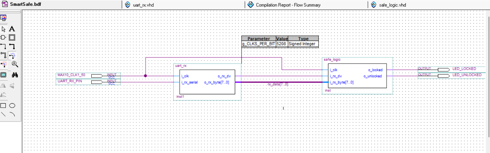
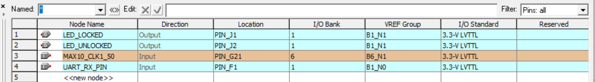

# FPGA-Smart-Safe
Project Overview

This project implements a Secure Digital Safe System on an Altera Cyclone III FPGA. The system manages a virtual vault with a locking mechanism controlled via a state machine (FSM).

To make the system interactive and modern, it uses the UART (Universal Asynchronous Receiver-Transmitter) protocol to communicate with an external terminal (such as a Smartphone or PC). This allows the user to input passwords and receive status updates (e.g., "Access Granted", "Locked") directly on their device screen.
 
Technical Specifications
FPGA: Altera Cyclone III (EP3C16F484C6).
Language: VHDL.
Baud Rate: 9600 bps.
Clock Frequency: 50 MHz.

Architecture:
The system is divided into three main modules:
1. UART_RX: Samples the serial input line and converts serial bits into 8-bit data bytes.
2. Safe_Logic: The core controller that compares user input to the stored password and manages security states.
3. UART_TX: Sends status messages back to the user terminal.

### Safe Logic Module
The `safe_logic.vhd` component acts as the system's brain. It processes incoming bytes and compares them against a hardcoded password. 
- **Input:** 8-bit data byte and a 'Data Valid' signal.
- **States:**
  - s_LOCKED: Initial state, waiting for input.
  - s_CHECK_BYTE: Validates each character in the sequence.
  - s_UNLOCKED: Reached only after the correct 4-digit code is entered.

## System Architecture
Below is the top-level block diagram showing the integration of the UART receiver and the safe control logic:

## Hardware Implementation & Pin Mapping

After designing the logic, I mapped the system's signals to the physical pins of the **Altera Cyclone III (EP3C16F484C6)** FPGA. This step ensures that the code correctly interacts with the board's hardware components like the internal clock and LEDs.

### Pin Configuration Table:
| Signal Name | Pin Location | I/O Standard | Description |
| :--- | :--- | :--- | :--- |
| MAX10_CLK1_50 | **PIN_G21** | 3.3-V LVTTL | Main 50MHz System Clock |
| UART_RX_PIN | **PIN_F1** | 3.3-V LVTTL | Serial Data Input (UART) |
| LED_LOCKED | **PIN_J1** | 3.3-V LVTTL | Red LED (Safe Locked) |
| LED_UNLOCKED | **PIN_J2** | 3.3-V LVTTL | Green LED (Access Granted) |

> **Note:** All pins were configured using the Quartus Pin Planner and set to the 3.3-V LVTTL standard to ensure hardware compatibility and prevent voltage mismatches.

Troubleshooting
During development, I encountered an issue where the pin planner wouldn't open because of an 'Auto Device' setting. 
I resolved this by manually assigning the correct FPGA part number (EP3C16F484C6) in the Device settings.
